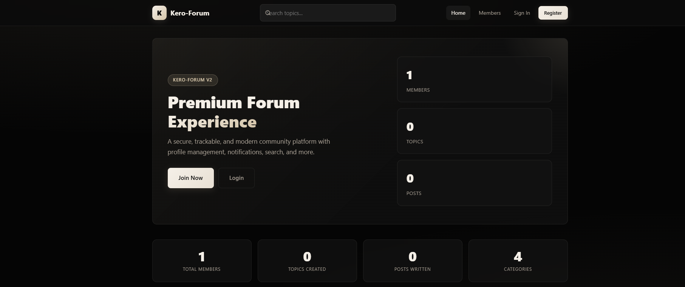
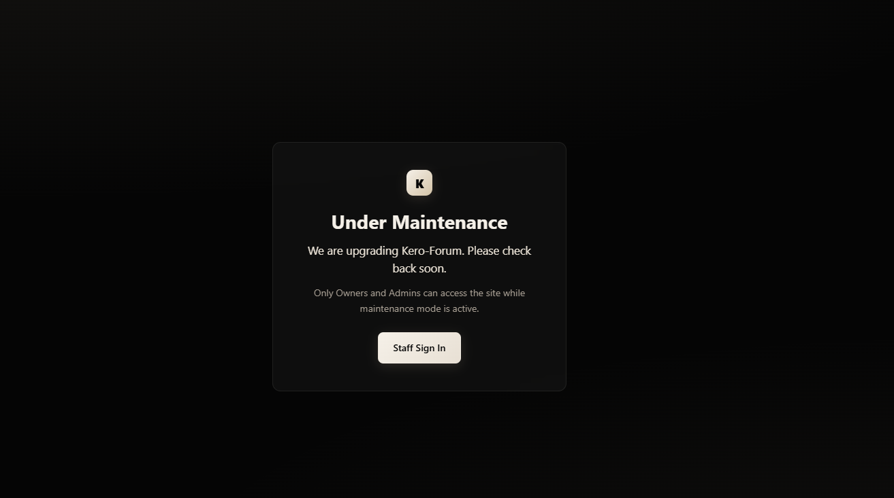
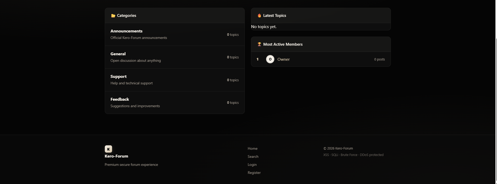
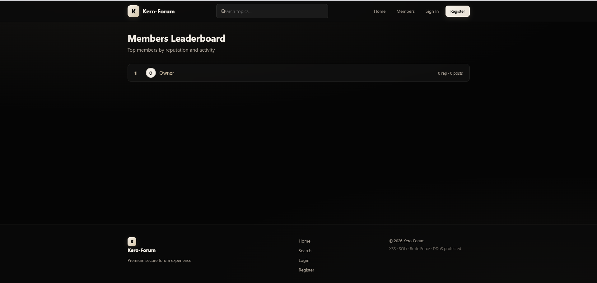
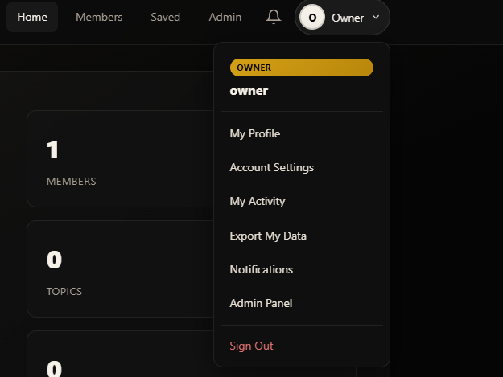
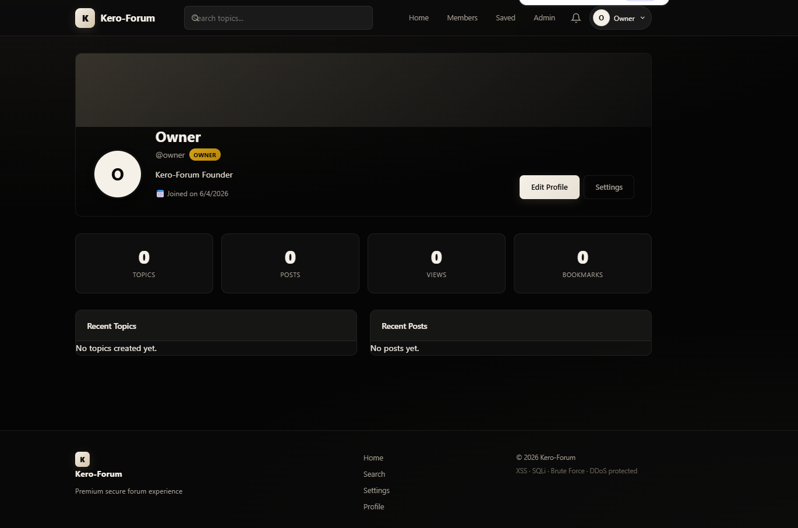
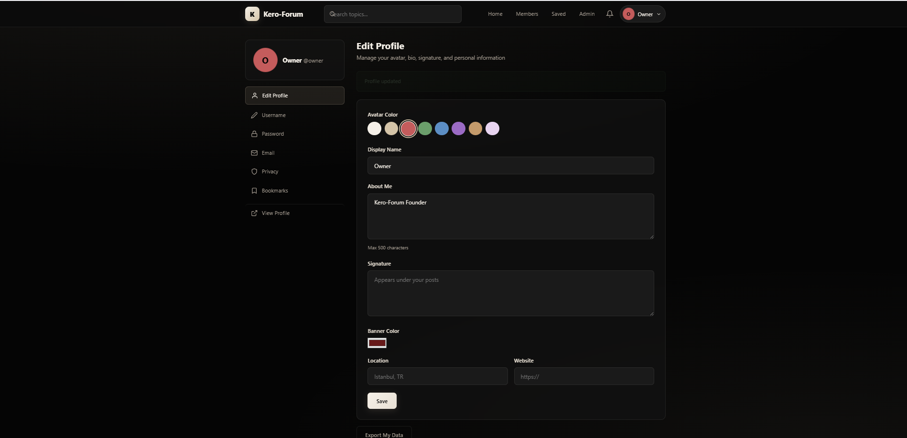
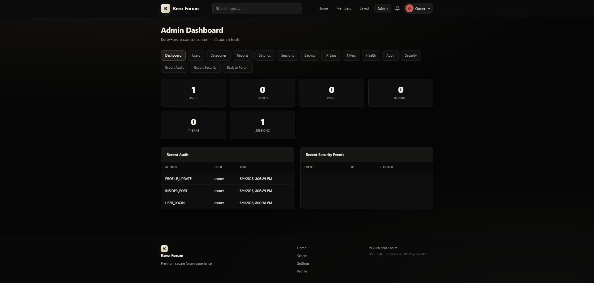

# Kero-Forum

**Kero-Forum** is a secure, full-featured forum template for GitHub. Black & cream theme, Owner / Admin / Mod / Member roles, admin panel with 25 tools, and 10 member features.


## Screenshots

| Home | Maintenance mode |
|:---:|:---:|
|  |  |

| Categories & sidebar | Members leaderboard |
|:---:|:---:|
|  |  |

| Owner user menu | Public profile |
|:---:|:---:|
|  |  |

| Edit profile | Admin dashboard |
|:---:|:---:|
|  |  |

Full gallery on Imgur: [Home](https://imgur.com/a/MLd1C5V) · [Maintenance](https://imgur.com/a/81U3XSP) · [Categories](https://imgur.com/a/1AOvcjA) · [Leaderboard](https://imgur.com/a/Xgszvpy) · [User menu](https://imgur.com/a/Bj8jWPl) · [Profile](https://imgur.com/a/rzufJ5l) · [Edit profile](https://imgur.com/a/UZiXXOf) · [Admin](https://imgur.com/a/pzpDXSo)

**Maintenance mode** (Owner → `/admin/settings`): blocks public visitors; Owner and Admin can still sign in and manage the site.

---

## Quick Start

### Requirements

- Node.js 18+
- npm

### Install

```bash
git clone https://github.com/keremKrsy/kero-forum.git
cd kero-forum
npm install
cp .env.example .env
```

Edit `.env` and change all secrets and the owner password before going live.

### Reset database (fresh start)

```bash
npm run reset
```

This deletes all forum data and creates a fresh database with default categories and the owner account.

### Start the server

```bash
npm start
```

Open **http://localhost:3000**

### Development (auto-reload)

```bash
npm run dev
```

### Stop the server

```bash
npm run stop
```

Or press `Ctrl+C` in the terminal where the server is running.

On Windows you can also kill port 3000 manually:

```powershell
Get-NetTCPConnection -LocalPort 3000 | ForEach-Object { Stop-Process -Id $_.OwningProcess -Force }
```

---

## Default Owner Account

| Field    | Default              |
|----------|----------------------|
| Username | `owner`              |
| Password | `KeroOwner2026!`     |
| Email    | `owner@kero-forum.local` |

Change these in `.env` before deployment.

---

## Member Features (10)

| # | Feature | Location |
|---|---------|----------|
| 1 | Edit own posts (30 min window) | Topic page |
| 2 | Delete own posts | Topic page |
| 3 | Report posts/topics/users | Topic page / forms |
| 4 | Watch/unwatch topics | Topic page |
| 5 | React to posts (like) | Topic page |
| 6 | Export personal data (JSON) | Settings → Export |
| 7 | Activity timeline | `/member/activity` |
| 8 | Members leaderboard | `/member/leaderboard` |
| 9 | Reputation score | Profile page |
| 10 | Profile banner color | Settings → Profile |

---

## Admin Features (25)

| # | Feature | Path |
|---|---------|------|
| 1 | Extended dashboard stats | `/admin` |
| 2 | User search | `/admin/users?q=` |
| 3 | Role assignment (User/Mod/Admin) | `/admin/users` |
| 4 | Ban / unban users | `/admin/users` |
| 5 | Staff notes on users | `/admin/users` |
| 6 | Category create | `/admin/categories` |
| 7 | Category edit (name, desc, lock) | `/admin/categories?edit=ID` |
| 8 | Category delete | `/admin/categories` |
| 9 | Category slow mode | Category edit |
| 10 | Category min post length | Category edit |
| 11 | Category post permissions | Category edit |
| 12 | Mass purge topics in category | Category edit (Owner) |
| 13 | Abuse reports queue | `/admin/reports` |
| 14 | Site announcement banner | `/admin/settings` |
| 15 | Maintenance mode | `/admin/settings` |
| 16 | Registration toggle | `/admin/settings` |
| 17 | Auto-lock old topics | `/admin/settings` |
| 18 | Blocked email domains | `/admin/settings` |
| 19 | IP ban management | `/admin/ip-bans` |
| 20 | Word filter (regex) | `/admin/filters` |
| 21 | Export audit log CSV | `/admin/export/audit` |
| 22 | Export security events CSV | `/admin/export/security` |
| 23 | View/revoke sessions | `/admin/sessions` |
| 24 | System health panel | `/admin/health` |
| 25 | Database backup download | `/admin/backup` |

Moderators also have: pin/lock/delete topics, delete posts, edit any post.

---

## Security

- XSS, SQLi, CSRF protection
- DDoS / DoS rate limiting
- Brute force login protection
- Session hijacking fingerprint
- IP ban enforcement
- Host header validation (production)
- URL interpretation attack blocking
- MITM headers (HSTS in production)
- Malware path blocking
- Drive-by / CSP protection
- Insider threat audit logging
- Word filter on post content

---

## Project Structure

```
kero-forum/
├── server.js           Entry point
├── config/             App configuration
├── database/init.js    SQLite schema + seed
├── models/             Data layer (forum.js, admin.js)
├── middleware/         Auth, security, shield, site
├── routes/             forum, auth, admin, member, profile, settings
├── views/              EJS templates (English)
├── public/             CSS + JS
├── scripts/
│   ├── reset.js        Wipe database
│   └── stop.js         Stop server
└── data/               SQLite files (gitignored)
```

---

## Environment Variables

| Variable | Description |
|----------|-------------|
| `PORT` | Server port (default 3000) |
| `NODE_ENV` | `development` or `production` |
| `SESSION_SECRET` | Session key (min 32 chars recommended) |
| `SESSION_FP_SALT` | Session fingerprint salt |
| `ALLOWED_HOSTS` | Comma-separated allowed Host headers |
| `OWNER_USERNAME` | Default owner username |
| `OWNER_PASSWORD` | Default owner password |
| `TRUST_PROXY` | Set `1` behind nginx/reverse proxy |

---

## Production Checklist

1. Set `NODE_ENV=production`
2. Use strong `SESSION_SECRET` (32+ characters)
3. Change owner credentials
4. Set `TRUST_PROXY=1` behind reverse proxy
5. Use HTTPS (HSTS activates automatically in production)
6. Configure `ALLOWED_HOSTS` with your domain

---

## Scripts Reference

| Command | Action |
|---------|--------|
| `npm install` | Install dependencies |
| `npm start` | Start server |
| `npm run dev` | Start with file watch |
| `npm run reset` | Delete database and re-seed |
| `npm run stop` | Kill process on PORT |

---

## License

This project is licensed under the **MIT License**.

Copyright (c) 2026 [keremKrsy](https://github.com/keremKrsy)

You are free to use, copy, modify, merge, publish, distribute, sublicense, and sell copies of this software, as long as the copyright notice and license text are included. See the [LICENSE](LICENSE) file for the full legal text.

---

**Kero-Forum** — Secure forum template by [keremKrsy](https://github.com/keremKrsy).
